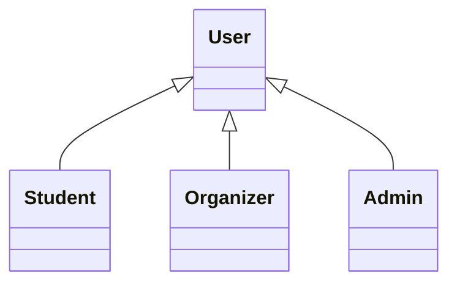
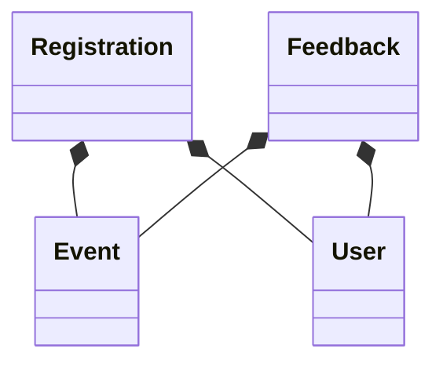

# se-final-project
Software Engineering final project repo for Group 19 (Abigail, Kojo, Rahinatu, Steve)

NB: This is _not_ the final version of this README file; more updates are expected to come.

# Problem statement
In Ashesi University, student participation in campus events is low. This is due to the lack of a  centralised platform to put event notices, register and be reminded about events for Ashesi. Event organisers also struggle with tracking their campus event attendance and event management.

# Solution
A **web-based campus event management and registration platform** that aims
to address these issues by centralising event information, streamlining registrations, and
providing automated reminders; the platform will also simplify event planning, promotion, and participation.

# Requirements
1. Functional:
- Event Management: Organisers can create, edit, and delete events.
- Registration and Reminders: Students can register for events and receive reminders
on the platform itself.
- Event Recommendations: Provide personalized event suggestions.
- Feedback Collection: Gather post-event reviews.
- Calendar Integration: Allow students to sync events with personal calendars.
- User Authentication: Secure login for students and organisers using their Ashesi
credentials.
- Admin Panel: Provide ASC and OSCA with tools to manage events and view
analytics.

2. Non-functional:
- Performance: The platform should load event pages within 3 seconds.
- Scalability: It should handle up to 500 concurrent users without performance issues.
- Security: Use HTTPS and encrypted passwords to protect user data.
- Usability: The interface should be intuitive and mobile-friendly.
- Reliability: Keeping event registrations available 24/7.
- Maintainability: Use a modular code structure to facilitate updates and debugging.
- Accessibility: Adhere to web accessibility standards to ensure usability for all students.

# Tech Stack
1. Frontend:
- HTML: This is used to create the structural layout of the platform.
- Vanilla CSS & Bootstrap: This is for styling and ensuring mobile responsiveness.
- JavaScript: For interactive elements and dynamic behavior.

2. Backend:
- PHP: For managing business logic and server-side operations.
- MySQL: For storing user data, event details, and registration information.

3. Other Tools:
- XAMPP: For local development and testing
- phpMyAdmin: To manage and monitor the MySQL database

# File structure
NB: **Delete** dummy.txt in folders: put there to just make the folders show on Github (the latter doesn't show empty folders by default, and upon creation they were empty)
1. actions: contains backend code for controlling business logic of the functionalities.
2. assets: contains styling code and multimedia assets for the presentation layer (styling of frontend) of the platform.
3. db: contains db of platform
4. functions: contains functions and methods used in actions
5. plans: contains design docs and diagrams of platform
6. utils: contains useful utilities and miscellaneous functions
7. contains: contains frontend (html pages) of platform

# Event Management System - Test Documentation

This document provides an overview of the test cases implemented in the Event Management System.

## Test Structure

The test suite is organized into several categories, each focusing on different aspects of the system:

### 1. Event Management Tests (`tests/EventManagementTest.php`)
Tests the core event management functionality:
- `testCreateEvent`: Verifies successful event creation with valid data
- `testUpdateEvent`: Tests event updates and verifies changes
- `testDeleteEvent`: Ensures proper event deletion
- `testEventValidation`: Validates event data constraints:
  - Non-empty title
  - Positive max capacity
  - End datetime must be after start datetime

### 2. Event Registration Tests (`tests/EventRegistrationTest.php`)
Tests event registration functionality:
- `testRegisterForEvent`: Verifies successful event registration
- `testDuplicateRegistration`: Ensures users can't register for the same event twice
- `testCancelRegistration`: Tests registration cancellation
- `testEventCapacity`: Verifies capacity limits:
  - Prevents registrations when event is full
  - Uses database trigger to enforce capacity

### 3. Feedback System Tests (`tests/FeedbackTest.php`)
Tests the event feedback system:
- `testSubmitFeedback`: Verifies feedback submission
- `testGetEventFeedback`: Tests retrieval of event feedback
- `testInvalidFeedbackRating`: Ensures rating validation (1-5 range)

### 4. API Endpoint Tests (`tests/ApiEndpointsTest.php`)
Tests the API functionality:
- `testApiAuthentication`: Verifies API key validation
- `testGetEventsEndpoint`: Tests event listing endpoint
- `testCreateEventEndpoint`: Tests event creation via API
- `testUpdateEventEndpoint`: Tests event updates via API
- `testDeleteEventEndpoint`: Tests event deletion via API

## Database Constraints

The test suite implements several database-level constraints:

1. **Event Validation**:
   - Title cannot be empty
   - Max capacity must be positive
   - End datetime must be after start datetime

2. **Registration Constraints**:
   - Unique registration per user per event
   - Capacity limit enforcement via trigger

3. **Feedback Validation**:
   - Rating must be between 1 and 5
   - Required fields validation

## Running Tests

To run the test suite:

```bash
php vendor/bin/phpunit
```

To run specific test files:

```bash
php vendor/bin/phpunit tests/EventManagementTest.php
php vendor/bin/phpunit tests/EventRegistrationTest.php
php vendor/bin/phpunit tests/FeedbackTest.php
php vendor/bin/phpunit tests/ApiEndpointsTest.php
```

## Test Coverage

The test suite covers:
- Database operations
- Business logic validation
- API endpoints
- User interactions
- Data integrity constraints

## Best Practices Implemented

1. **Database Setup**:
   - Separate test database
   - Automatic table creation
   - Cleanup after tests

2. **Data Validation**:
   - Input validation
   - Business rule enforcement
   - Error handling

3. **Test Organization**:
   - Clear test categories
   - Descriptive test names
   - Independent test cases

4. **Security**:
   - API authentication
   - Data access control
   - Input sanitization

# Event Registration System - OOP Design Principles

## Inheritance and Composition in Our System

### Inheritance (Is-A Relationship)

In our system, we use inheritance to model different types of users:



#### Key Points about Inheritance:

1. **Base Class (User)**
   - Contains common attributes and methods for all users
   - Defines the basic structure and behavior
   - Attributes:
     - `user_id`
     - `first_name`
     - `last_name`
     - `email`
     - `password`
     - `role`

2. **Derived Classes**
   - **Student**: Specializes User for student-specific functionality
     - Additional attributes: `major`, `year_group`
     - Additional methods: `submitFeedback()`, `viewEventHistory()`
   
   - **Organizer**: Specializes User for event management
     - Additional attributes: `department`
     - Additional methods: `createEvent()`, `manageEventCapacity()`
   
   - **Admin**: Specializes User for system administration
     - Additional methods: `manageUsers()`, `generateReports()`

3. **Benefits of Inheritance**
   - Code reuse: Common functionality is defined once in the base class
   - Polymorphism: Can treat all user types as User objects
   - Extensibility: Easy to add new user types
   - Maintainability: Changes to common functionality only need to be made in one place

### Composition (Has-A Relationship)

Our system uses composition to model relationships between entities:



#### Key Points about Composition:

1. **Strong Ownership**
   - Registration cannot exist without both Event and User
   - Feedback cannot exist without both Event and User
   - If parent is deleted, child must also be deleted

2. **Component Relationships**
   - **Registration Component**
     - Composed of Event and User
     - Manages the relationship between events and users
     - Controls registration lifecycle

   - **Feedback Component**
     - Composed of Event and User
     - Manages user feedback for events
     - Tracks event ratings and comments

3. **Benefits of Composition**
   - Encapsulation: Components hide their implementation details
   - Flexibility: Can change component implementations without affecting the whole
   - Reusability: Components can be reused in different contexts
   - Maintainability: Easier to modify individual components

### When to Use Each

#### Use Inheritance When:
- You have an "is-a" relationship
- You need to share common behavior
- You want to use polymorphism
- The relationship is static and won't change

#### Use Composition When:
- You have a "has-a" relationship
- You need to change behavior at runtime
- You want to reuse functionality without inheritance
- The relationship is dynamic and might change

### Best Practices in Our System

1. **Inheritance Best Practices**
   - Keep inheritance hierarchies shallow
   - Use abstract classes for common behavior
   - Override methods carefully to maintain Liskov Substitution Principle
   - Use interfaces for role-based behavior

2. **Composition Best Practices**
   - Favor composition over inheritance
   - Use dependency injection
   - Keep components loosely coupled
   - Use interfaces for component communication

### Example Code Snippets

```php
// Inheritance Example
class User {
    protected $user_id;
    protected $first_name;
    protected $last_name;
    
    public function getFullName() {
        return $this->first_name . ' ' . $this->last_name;
    }
}

class Student extends User {
    private $major;
    
    public function getMajor() {
        return $this->major;
    }
}

// Composition Example
class Registration {
    private $event;
    private $user;
    private $registration_date;
    
    public function __construct(Event $event, User $user) {
        $this->event = $event;
        $this->user = $user;
        $this->registration_date = new DateTime();
    }
}
```

### Conclusion

Understanding and properly implementing inheritance and composition is crucial for building a maintainable and scalable system. Our event registration system uses both principles effectively to model different types of users and their relationships with events, registrations, and feedback.

## Design Patterns in Our System

Our system implements several design patterns to solve common problems and improve code organization:

### 1. Singleton Pattern
```php
class Database {
    private static $instance = null;
    private $conn;

    private function __construct() {
        $this->conn = new mysqli(DB_HOST, DB_USER, DB_PASS, DB_NAME);
    }

    public static function getInstance() {
        if (self::$instance === null) {
            self::$instance = new Database();
        }
        return self::$instance;
    }
}
```
- **Purpose**: Ensure only one database connection exists
- **Benefits**:
  - Prevents multiple database connections
  - Provides global access point
  - Controls resource usage
- **Usage**: Database connection management

### 2. Factory Pattern
```php
class UserFactory {
    public static function createUser($role, $data) {
        switch ($role) {
            case 'student':
                return new Student($data);
            case 'organizer':
                return new Organizer($data);
            case 'admin':
                return new Admin($data);
            default:
                throw new Exception("Invalid user role");
        }
    }
}
```
- **Purpose**: Create different types of users based on role
- **Benefits**:
  - Encapsulates object creation
  - Makes the system more maintainable
  - Reduces code duplication
- **Usage**: User creation and management

### 3. Observer Pattern
```php
class Event {
    private $observers = [];
    private $status;

    public function attach(EventObserver $observer) {
        $this->observers[] = $observer;
    }

    public function setStatus($status) {
        $this->status = $status;
        $this->notify();
    }
}

interface EventObserver {
    public function update(Event $event);
}

class EmailNotification implements EventObserver {
    public function update(Event $event) {
        // Send email notification
    }
}
```
- **Purpose**: Handle event notifications and updates
- **Benefits**:
  - Decouples event management from notification systems
  - Allows multiple systems to react to changes
  - Makes the system more flexible
- **Usage**: Event notifications and calendar updates

### 4. Strategy Pattern
```php
interface RegistrationStrategy {
    public function register($eventId, $userId);
    public function cancel($eventId, $userId);
}

class StudentRegistration implements RegistrationStrategy {
    public function register($eventId, $userId) {
        // Student-specific registration logic
    }
}

class RegistrationContext {
    private $strategy;

    public function setStrategy(RegistrationStrategy $strategy) {
        $this->strategy = $strategy;
    }
}
```
- **Purpose**: Handle different registration behaviors
- **Benefits**:
  - Makes the system more flexible
  - Encapsulates registration algorithms
  - Easy to add new registration types
- **Usage**: Different registration processes for different user types

### 5. Repository Pattern
```php
class EventRepository {
    private $db;

    public function __construct(Database $db) {
        $this->db = $db;
    }

    public function findById($id) {
        // Find event by ID
    }

    public function save(Event $event) {
        // Save event
    }
}
```
- **Purpose**: Abstract data access logic
- **Benefits**:
  - Separates data access from business logic
  - Makes the system more testable
  - Provides a clean API for data operations
- **Usage**: Database operations and data access

### 6. Template Method Pattern
```php
abstract class EventRegistration {
    public final function processRegistration($eventId, $userId) {
        $this->validateRegistration();
        $this->checkCapacity();
        $this->createRegistration();
        $this->notifyUser();
    }

    protected abstract function validateRegistration();
    protected abstract function checkCapacity();
    protected abstract function createRegistration();
    protected abstract function notifyUser();
}
```
- **Purpose**: Define the skeleton of an algorithm
- **Benefits**:
  - Promotes code reuse
  - Allows subclasses to redefine certain steps
  - Maintains consistent process flow
- **Usage**: Registration process management

### Benefits of Using Design Patterns

1. **Code Organization**
   - Clear structure and responsibilities
   - Consistent coding style
   - Better maintainability

2. **Flexibility**
   - Easy to extend functionality
   - Simple to modify behavior
   - Adaptable to changing requirements

3. **Reusability**
   - Common solutions to common problems
   - Reduced code duplication
   - Faster development

4. **Testability**
   - Clear separation of concerns
   - Easy to test individual components
   - Better code coverage

5. **Scalability**
   - Modular architecture
   - Easy to add new features
   - Better performance management

### Best Practices for Design Patterns

1. **Choose Wisely**
   - Use patterns that solve specific problems
   - Avoid over-engineering
   - Consider maintainability

2. **Keep It Simple**
   - Use patterns only when needed
   - Avoid unnecessary complexity
   - Focus on readability

3. **Documentation**
   - Document pattern usage
   - Explain design decisions
   - Provide usage examples

4. **Testing**
   - Test pattern implementations
   - Verify behavior
   - Ensure reliability

### Conclusion

Design patterns provide proven solutions to common software design problems. Our system implements several patterns to improve code organization, maintainability, and scalability. By following these patterns and best practices, we ensure a robust and flexible event registration system.
